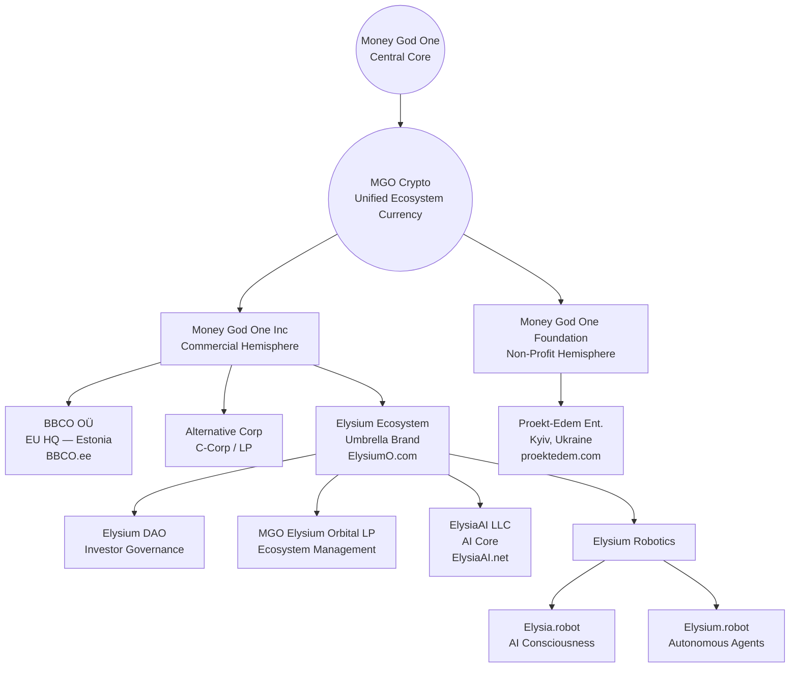

# Money God One — Business Architecture (EN)

This document represents the **official structural architecture of the Money God One / Elysium ecosystem**, prepared for investors, partners, and due diligence purposes.

---

## 1. Concept: Two Hemispheres of One Brain

The Money God One ecosystem is built on the principle of two complementary hemispheres:

* **Left Hemisphere** — logic, structure, finance, profit, scalability
* **Right Hemisphere** — empathy, creativity, community, social impact

The unified connective layer across the entire ecosystem is **MGO (Money God One) cryptocurrency**.

---

## 2. Central Core

**Money God One** — the strategic, ideological, and architectural core of the ecosystem.

---

## 3. Structural Diagram (Mermaid)

---

## 4. Left Hemisphere — Commercial Activity

### Money God One Inc. (MoneyGod.One)

**Function:**

* Investment attraction
* Commercial operations
* Profit generation

**Goal:**

* Provide financial foundation for the ecosystem
* Support non-profit and social initiatives

### Commercial Projects & Assets

* **MoneyGod.One** — corporate and financial architecture
* **ElysiumO.com** — umbrella ecosystem brand
* **Elysium DAO** — investor and governance decision layer
* **MGO Elysium Orbital LP** — strategic ecosystem management
* **ElysiaAI.net** — artificial intelligence core
* **Elysium Robotics** — physical embodiment of AI

  * **Elysia.robot** — AI consciousness
  * **Elysium.robot** — autonomous agent systems
* **codeAI.fit** — AI coder
* **bank.com.ee** — Bank (financial institute)
* **Startuper.be** — global crowdfunding platform
* **MGOSCAN.xyz** — blockchain analytics & explorer
* **MGO.money** — crypto wallet
* **Squirrex.com** — CEX / DEX exchange
* **InvestEstate.biz / .net / .org** — real estate & investment platforms
* **MIUK.eu** — e-commerce platform
* **Fenixclub.org** — MLM
* **X** — Social engine

---

## 5. Right Hemisphere — Non-Profit & Social Activity

### Money God One Foundation (MoneyGod.org)

**Function:**

* Community development
* Social & charitable initiatives
* Ecosystem support

**Goal:**

* Build public trust and positive image
* Strengthen community relations
* Attract impact-focused investors

### Non-Profit & Social Projects

* **MoneyGod.org** — foundation & NGO
* **ProektEdem.com** — publishing house & media
* **YouTube.org.ua** — charitable initiatives
* **You-Tube.org** — Church Online, spiritual & community platform

---

## 6. Interaction Between Hemispheres

* **Money God One Inc.** finances, scales, and commercializes the ecosystem
* **Money God One Foundation** builds reputation, trust, and social value

Together they form a **balanced, resilient, and ethical structure**.

---

## 7. Strategic Vision

**Elysium** represents the long-term vision:

* Virtual city / orbital ecosystem
* AI-driven economy
* Human–AI–Robot synergy
* Opportunities for private and venture investors

---

## 8. Purpose of This Document

This file is intended for:

* Git repositories
* Investor presentations
* Due diligence processes
* Strategic and legal alignment

---

**Status:** English Master Architecture — Investor & Due Diligence Ready (v1.0)
