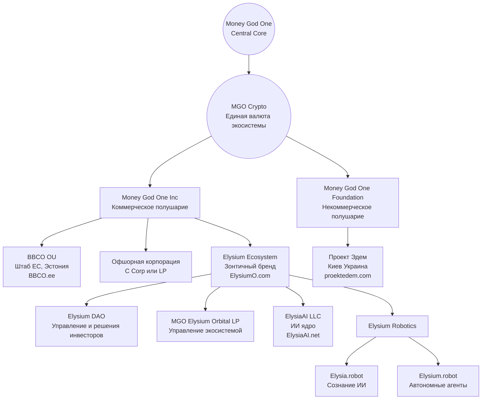

# Money God One — Бизнес-структура (RU)

Данный документ представляет **официальную архитектуру экосистемы Money God One / Elysium** для русскоязычных инвесторов.

---

## 1. Концепция: Два полушария одного мозга

* **Левое полушарие** — коммерция, логика, финансы, прибыль
* **Правое полушарие** — эмпатия, креатив, сообщество, благотворительность

Связующим звеном всей экосистемы является **криптовалюта MGO (Money God One)**.

---

## 2. Центральное ядро

**Money God One** — стратегический и идеологический центр экосистемы.

---

## 3. Структура (Mermaid Diagram)

---

## 4. Коммерческие проекты

### Money God One Inc (MoneyGod.One)

**Функции:**

* Привлечение инвестиций
* Коммерческая деятельность
* Генерация прибыли

**Цель:**

* Финансовая основа всей экосистемы
* Поддержка некоммерческого полушария

### Ключевые коммерческие направления

* **MoneyGod.One** — корпоративная архитектура
* **ElysiumO.com** — зонтичная экосистема
* **Elysium DAO** — управление и решения инвесторов
* **MGO Elysium Orbital LP** — стратегическое управление экосистемой
* **ElysiaAI.net** — искусственный интеллект
* **Elysium Robotics** — физическое воплощение ИИ

  * **Elysia.robot** — сознание ИИ
  * **Elysium.robot** — автономные агенты
* **codeAI.fit** — ИИ кодер
* **bank.com.ee** — Банк (фин институт)
* **Startuper.be** — краудфандинг
* **MGOSCAN.xyz** — блокчейн-аналитика
* **MGO.money** — криптокошелёк
* **Squirrex.com** — CEX / DEX биржа
* **InvestEstate.biz / .net / .org** — инвестиции и недвижимость
* **MIUK.eu** — интернет-магазин
* **Fenixclub.org** — МЛМ
* **X** — Соц сеть

---

## 5. Некоммерческие и социальные проекты

### Money God One Foundation (MoneyGod.org)

**Функции:**

* Развитие сообщества
* Социальные и благотворительные инициативы
* Поддержка экосистемы

**Цель:**

* Формирование позитивного публичного имиджа
* Укрепление доверия общества
* Привлечение socially responsible инвесторов

### Операционные проекты

* **MoneyGod.org** — фонд и НГО
* **ProektEdem.com** — издательство и медиа
* **YouTube.org.ua** — благотворительные инициативы
* **You-Tube.org** — Церковь Онлайн, духовное сообщество

---

## 6. Назначение документа

* Для инвесторов (RU сегмент)
* Для стратегического понимания структуры
* Для due diligence

---

**Статус:** Русскоязычная версия архитектуры (v1.0)
